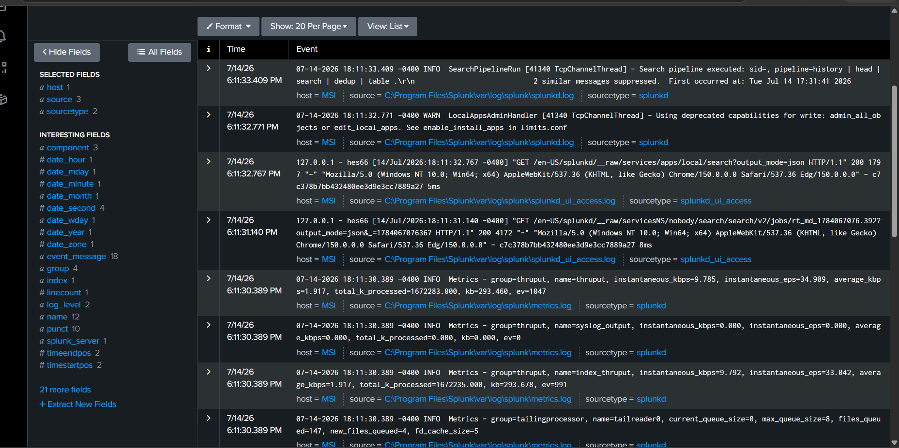
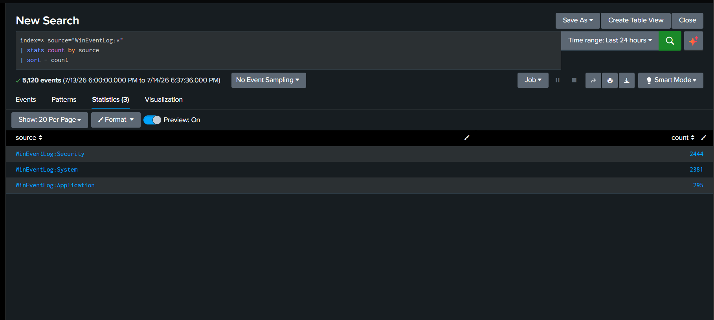
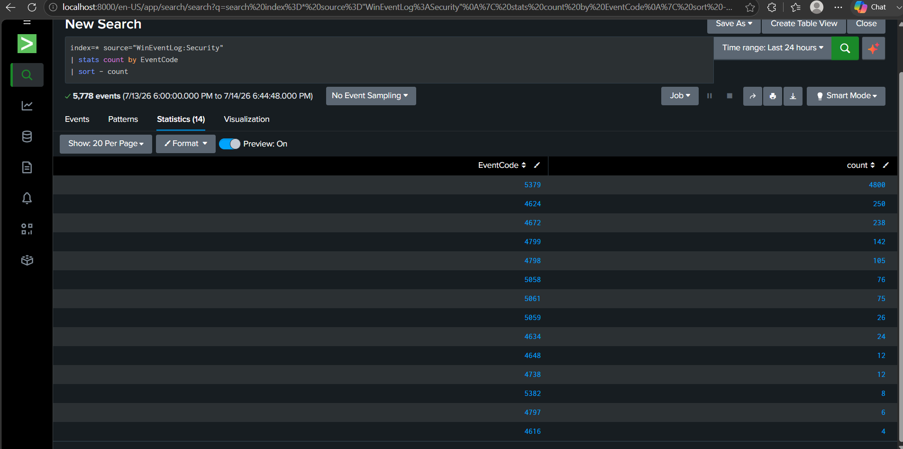
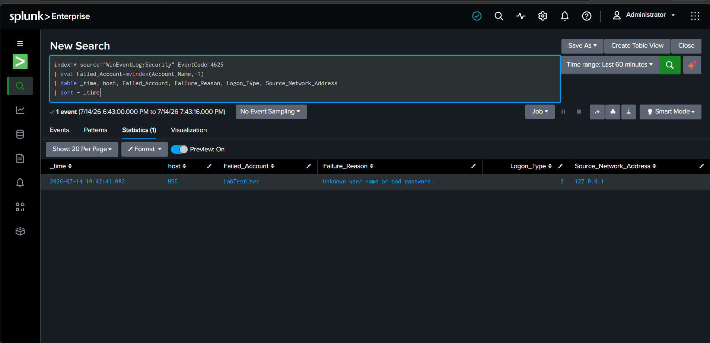
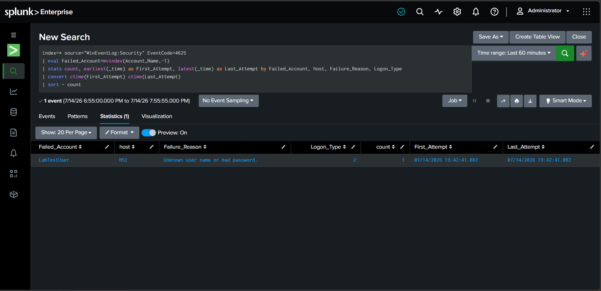
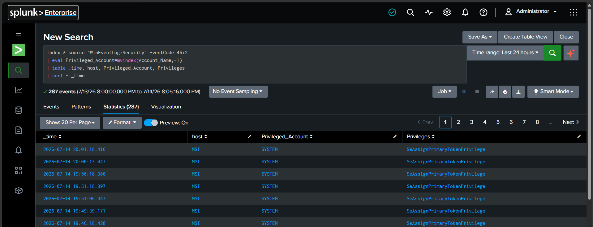
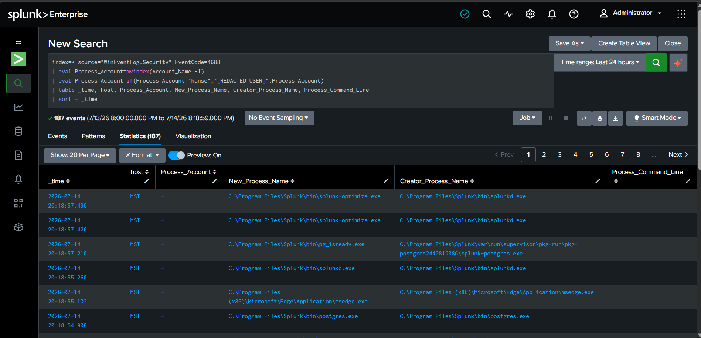

# Lab 01: Splunk Windows Log Analysis

## Lab Status

**Completed**

## Overview

This lab demonstrates how Splunk Enterprise can be used to collect, search, and analyze local Windows event logs from a Security Operations Center perspective.

The investigation focused on:

- Windows authentication activity
- Successful logons
- Failed logons
- Privileged logon sessions
- Process creation events
- Security event summarization
- Evidence collection and documentation

## Objective

The objective of this lab was to configure Splunk Enterprise to collect Windows Security, System, and Application logs and then use Splunk Search Processing Language to investigate authentication and process activity.

## Tools Used

- Splunk Enterprise
- Windows Security Event Logs
- Windows Event Viewer
- Windows PowerShell
- Windows Audit Policy
- GitHub

## Lab Environment

Splunk Enterprise was installed locally on a Windows computer.

The following local Windows Event Log channels were added to Splunk:

- Security
- System
- Application

Personal account information was redacted from screenshots intended for the public GitHub repository.

## Investigation Scenario

A Windows endpoint was monitored using Splunk Enterprise.

The investigation included reviewing normal authentication activity, generating one controlled failed login, reviewing accounts receiving sensitive privileges, and examining recently created Windows processes.

The controlled security activity was created only for this lab and did not represent a real attack.

---

# Important Windows Event IDs

| Event ID | Description |
|---|---|
| 4624 | A successful account logon occurred |
| 4625 | An account failed to log on |
| 4672 | Sensitive privileges were assigned to a new logon |
| 4688 | A new process was created |
| 5379 | Credential Manager credentials were read |

---

# Investigation Steps

1. Installed and opened Splunk Enterprise.
2. Confirmed that Splunk was indexing its internal logs.
3. Configured Windows Security, System, and Application logs as data inputs.
4. Confirmed that all three Windows log sources were entering Splunk.
5. Created a statistical summary of Windows Security Event IDs.
6. Investigated successful Windows logons using Event ID 4624.
7. Reviewed interactive and cached interactive logon types.
8. Created a temporary local account named `LabTestUser`.
9. Enabled the required Windows audit settings.
10. Generated one controlled failed interactive login.
11. Investigated the failed login using Event ID 4625.
12. Created a statistical failed-login summary.
13. Investigated privileged sessions using Event ID 4672.
14. Investigated process creation using Event ID 4688.
15. Reviewed process and parent-process relationships.
16. Removed the temporary local account.
17. Redacted personal information before publishing evidence.

---

# Splunk Searches

## 1. Confirm Splunk Is Working

```spl
index=_internal
| head 20
```

This search confirmed that Splunk was running and indexing its internal operational events.

## 2. Confirm Windows Event Log Collection

```spl
index=* source="WinEventLog:*"
| stats count by source
| sort - count
```

This search displayed the total number of events collected from each Windows Event Log source.

## 3. Create a Security Event ID Summary

```spl
index=* source="WinEventLog:Security"
| stats count by EventCode
| sort - count
```

This search grouped Windows Security events by Event ID and sorted them by frequency.

## 4. Investigate Successful Interactive Logons

```spl
index=* source="WinEventLog:Security" EventCode=4624
(Logon_Type=2 OR Logon_Type=7 OR Logon_Type=10 OR Logon_Type=11)
| eval Target_Account=mvindex(Account_Name,-1)
| eval Target_Account=if(match(Target_Account,"@"),"[REDACTED USER ACCOUNT]",Target_Account)
| table _time, host, Target_Account, Logon_Type, Source_Network_Address
| sort - _time
```

The search filtered successful logons for interactive, unlock, Remote Desktop, and cached interactive activity.

## 5. Investigate Failed Logons

```spl
index=* source="WinEventLog:Security" EventCode=4625
| eval Failed_Account=mvindex(Account_Name,-1)
| table _time, host, Failed_Account, Failure_Reason, Logon_Type, Source_Network_Address
| sort - _time
```

This search displayed the account involved in the failed login, the failure reason, logon type, host, and source address.

## 6. Summarize Failed Logons

```spl
index=* source="WinEventLog:Security" EventCode=4625
| eval Failed_Account=mvindex(Account_Name,-1)
| stats count, earliest(_time) as First_Attempt, latest(_time) as Last_Attempt by Failed_Account, host, Failure_Reason, Logon_Type
| convert ctime(First_Attempt) ctime(Last_Attempt)
| sort - count
```

This search summarized the total attempts, first attempt, last attempt, account, host, failure reason, and logon type.

## 7. Investigate Privileged Logons

```spl
index=* source="WinEventLog:Security" EventCode=4672
| eval Privileged_Account=mvindex(Account_Name,-1)
| eval Privileged_Account=if(match(Privileged_Account,"@"),"[REDACTED USER ACCOUNT]",Privileged_Account)
| table _time, host, Privileged_Account, Privileges
| sort - _time
```

This search displayed accounts that were assigned sensitive Windows privileges.

## 8. Investigate Process Creation

```spl
index=* source="WinEventLog:Security" EventCode=4688
| eval Process_Account=mvindex(Account_Name,-1)
| eval Process_Account=if(Process_Account="hanse","[REDACTED USER]",Process_Account)
| table _time, host, Process_Account, New_Process_Name, Creator_Process_Name, Process_Command_Line
| sort - _time
```

This search displayed newly created processes and the parent processes responsible for launching them.

---

# Findings

## Windows Log Collection

Splunk successfully collected the following Windows log sources:

- `WinEventLog:Security`
- `WinEventLog:System`
- `WinEventLog:Application`

The collection results confirmed that the local endpoint was successfully sending Windows events into Splunk.

## Security Event Summary

The Event ID summary showed several Windows Security event types.

Notable events included:

- Event ID 4624 for successful logons
- Event ID 4672 for privileged logons
- Event ID 4688 for new processes
- Event ID 5379 for Credential Manager activity

A high number of events alone does not prove malicious behavior. Event context, account information, timing, source systems, and surrounding activity must also be reviewed.

## Successful Logons

The successful-login investigation identified Logon Types 7 and 11.

- **Logon Type 7** represented a computer unlock.
- **Logon Type 11** represented a cached interactive logon.
- The source address `127.0.0.1` represented the local computer.

The activity appeared consistent with expected local Windows authentication.

## Failed Login

One controlled failed login was generated using the temporary local account:

```text
LabTestUser
```

The resulting Event ID 4625 showed:

- Failed account: `LabTestUser`
- Failure reason: Unknown username or bad password
- Logon Type: 2
- Source address: `127.0.0.1`
- Total attempts: 1

Logon Type 2 represented an interactive login attempt at the local computer.

Because only one controlled failed attempt occurred, the activity was not classified as brute force.

In a real SOC environment, the following activity would require additional investigation:

- Repeated failed attempts against one account
- Failed attempts across many accounts
- Attempts originating from an unfamiliar address
- A successful login immediately after repeated failures
- Attempts occurring at unusual times
- Similar activity across several endpoints

## Privileged Logons

Event ID 4672 activity was primarily associated with the Windows `SYSTEM` account.

The visible privilege activity included Windows privileges such as:

```text
SeAssignPrimaryTokenPrivilege
```

The activity appeared consistent with operating-system and Windows service activity.

Privileged logons involving unfamiliar accounts, unusual timing, or suspicious associated processes would require escalation.

## Process Creation

Event ID 4688 showed several Windows and Splunk processes, including:

- `RuntimeBroker.exe`
- `backgroundTaskHost.exe`
- `svchost.exe`
- `splunkd.exe`
- `splunk.exe`
- `cmd.exe`
- `postgres.exe`

The creator-process information helped identify what launched each process.

No clearly suspicious process activity was identified in the reviewed results.

The command-line field was blank for some events because detailed process command-line auditing was not enabled for every event.

---

# MITRE ATT&CK Context

Repeated authentication failures may be associated with:

- **Tactic:** Credential Access
- **Technique:** Brute Force
- **Technique ID:** T1110

The single controlled failed login performed during this lab was not classified as brute-force activity.

---

# Screenshots

## 1. Splunk Internal Events

This screenshot confirms that Splunk was running and indexing its internal logs.



## 2. Windows Event Sources

This screenshot confirms that Splunk collected Security, System, and Application events.



## 3. Security Event ID Summary

This screenshot shows Windows Security events grouped by Event ID.



## 4. Successful Login Investigation

This screenshot shows successful interactive and cached authentication activity.


## 5. Failed Login Investigation

This screenshot shows the controlled Event ID 4625 failed login for `LabTestUser`.



## 6. Failed Login Summary

This screenshot summarizes the failed account, total attempts, failure reason, and timestamps.



## 7. Privileged Logon Investigation

This screenshot shows Event ID 4672 privileged Windows logon activity.



## 8. Process Creation Investigation

This screenshot shows Event ID 4688 process and parent-process activity.



---

# Analyst Conclusion

Splunk Enterprise successfully collected and searched local Windows Security, System, and Application events.

The investigation demonstrated how a SOC analyst can:

- Validate security log collection
- Search authentication activity
- Investigate successful and failed logons
- Summarize failed authentication attempts
- Review privileged sessions
- Analyze process creation
- Examine parent and child process relationships
- Document findings
- Redact personal information before sharing evidence

The reviewed activity appeared consistent with expected Windows behavior and controlled lab testing.

In a production investigation, I would correlate the activity with:

- Endpoint history
- User behavior
- Source IP reputation
- Threat intelligence
- Additional authentication logs
- Process command-line data
- Network traffic
- Activity across other systems

Further investigation and escalation would be based on the full event context rather than one event alone.

---

# Skills Demonstrated

- Splunk Enterprise
- Splunk Search Processing Language
- Windows Event Log collection
- Windows audit policy configuration
- Authentication investigation
- Failed-login analysis
- Privileged-account monitoring
- Process creation analysis
- Parent-process analysis
- Event correlation
- MITRE ATT&CK mapping
- Security evidence collection
- Data redaction
- SOC investigation documentation
- GitHub technical documentation

---

# Resume Project Description

Analyzed Windows authentication, privileged logon, and process creation events using Splunk Enterprise. Investigated Event IDs 4624, 4625, 4672, and 4688, generated controlled security events, created analyst summaries, and documented findings in a public GitHub cybersecurity portfolio.
