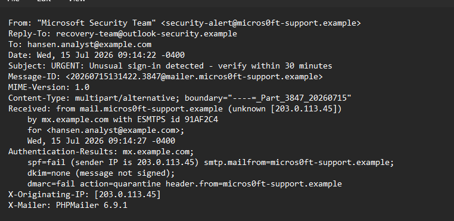
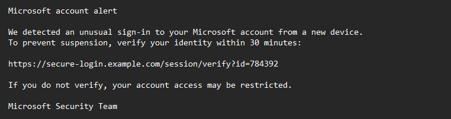
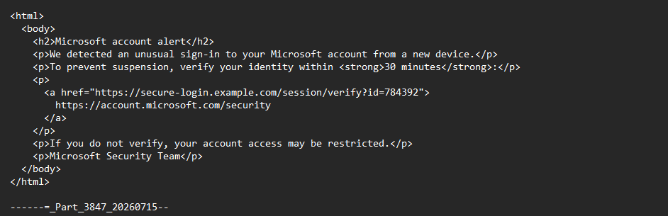
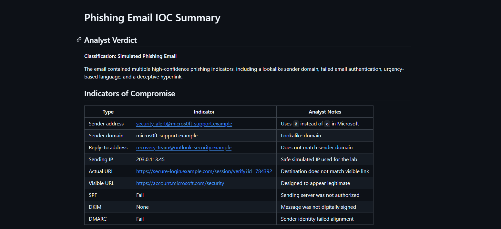

# Lab 02: Phishing Email Investigation

## Lab Status

**Completed**

## Overview

This lab documents the investigation of a safe simulated phishing email from the perspective of a SOC analyst.

The investigation focused on the email sender, reply-to address, authentication results, sending infrastructure, social-engineering language, and deceptive hyperlink.

## Objective

The objective of this lab was to analyze a suspicious email, identify phishing indicators, document indicators of compromise, assign an analyst verdict, and recommend appropriate response actions.

## Tools Used

- Raw `.eml` email file
- Windows Notepad
- Email header analysis
- GitHub
- MITRE ATT&CK

## Evidence File

[View the simulated phishing email](lab-02-simulated-phishing-email.eml)

> This lab used safe simulated domains and IP addresses. No real malicious infrastructure was accessed.

## Investigation Scenario

A user reported an urgent email claiming that unusual activity had been detected on their Microsoft account.

The message instructed the recipient to verify their identity within 30 minutes or risk having their account access restricted.

The email was investigated to determine whether it was legitimate, suspicious, or malicious.

## Email Details

| Field | Observed Value |
|---|---|
| Display name | Microsoft Security Team |
| Sender address | security-alert@micros0ft-support.example |
| Reply-To address | recovery-team@outlook-security.example |
| Sending IP | 203.0.113.45 |
| Subject | URGENT: Unusual sign-in detected - verify within 30 minutes |
| SPF | Fail |
| DKIM | None |
| DMARC | Fail |

## Investigation Steps

1. Opened the raw `.eml` file in Notepad.
2. Reviewed the display name and sender address.
3. Examined the sender domain for impersonation.
4. Compared the sender and reply-to domains.
5. Reviewed the sending IP address.
6. Analyzed SPF, DKIM, and DMARC results.
7. Reviewed the message for fear and urgency tactics.
8. Compared the displayed URL with the actual destination.
9. Documented indicators of compromise.
10. Assigned an analyst verdict.
11. Developed response and containment recommendations.

## Findings

### Lookalike Sender Domain

The sender claimed to represent Microsoft, but the address was:

```text
security-alert@micros0ft-support.example
```

The word `micros0ft` used the number `0` instead of the letter `o`.

This was a lookalike-domain technique designed to impersonate a trusted brand.

### Reply-To Mismatch

The reply-to address was:

```text
recovery-team@outlook-security.example
```

The reply-to domain did not match the sender domain.

This inconsistency indicated that replies could be redirected to a separate mailbox controlled by the sender.

### Failed Email Authentication

The message produced the following authentication results:

```text
spf=fail
dkim=none
dmarc=fail
```

The message failed SPF and DMARC and did not contain a DKIM signature.

These authentication results significantly increased the likelihood that the sender identity was spoofed or unauthorized.

### Urgency and Fear

The message instructed the recipient to verify their identity within 30 minutes.

It also warned that account access might be restricted.

This urgency was intended to pressure the recipient into acting before carefully inspecting the message.

### Deceptive Hyperlink

The link displayed to the recipient was:

```text
https://account.microsoft.com/security
```

However, the actual HTML destination was:

```text
https://secure-login.example.com/session/verify?id=784392
```

The displayed URL and actual destination did not match.

This was a strong phishing indicator because the link appeared to lead to Microsoft but actually directed the recipient to another domain.

## Indicators of Compromise

| Type | Indicator | Analyst Notes |
|---|---|---|
| Sender address | security-alert@micros0ft-support.example | Lookalike Microsoft spelling |
| Sender domain | micros0ft-support.example | Uses `0` instead of `o` |
| Reply-To address | recovery-team@outlook-security.example | Does not match sender domain |
| URL domain | secure-login.example.com | Actual link destination |
| Sending IP | 203.0.113.45 | Safe simulated IP |
| SPF | Fail | Sending system was not authorized |
| DKIM | None | Message was not digitally signed |
| DMARC | Fail | Sender identity failed alignment |

## Analyst Verdict

**Classification: Simulated Phishing Email**

The email contained several high-confidence phishing indicators:

- Lookalike sender domain
- Sender and reply-to mismatch
- Failed SPF
- Missing DKIM signature
- Failed DMARC
- Urgent account-suspension language
- Mismatched displayed and actual URLs

The recipient should not click the link, reply to the email, or provide credentials.

## Recommended Response Actions

1. Quarantine or delete the message.
2. Block the sender address and related domains.
3. Block the destination URL.
4. Search for other recipients of the same message.
5. Determine whether any users clicked the link.
6. Reset credentials if information was submitted.
7. Revoke active sessions if compromise is suspected.
8. Review authentication logs for unusual sign-ins.
9. Preserve the original email as evidence.
10. Document and escalate the incident according to organizational procedures.

## MITRE ATT&CK Mapping

- Tactic: Initial Access
- Technique: Phishing
- Technique ID: T1566
- Method observed: Deceptive link

## Screenshots

### Email Header Analysis



### Phishing Message Body



### Link Mismatch Analysis



### IOC Summary



## Analyst Conclusion

The investigated message was classified as a simulated phishing email.

The sender used a lookalike domain, mismatched reply-to information, failed authentication checks, urgent language, and a deceptive hyperlink.

This lab demonstrated how a SOC analyst can combine technical email-header evidence with social-engineering indicators to classify a suspicious message and recommend containment and response actions.

## Skills Demonstrated

- Phishing email investigation
- Email header analysis
- SPF, DKIM, and DMARC interpretation
- Sender-domain analysis
- Reply-to mismatch detection
- Deceptive-link identification
- Social-engineering analysis
- IOC documentation
- MITRE ATT&CK mapping
- Incident-response recommendations
- GitHub technical documentation

## Resume Project Description

Investigated a simulated phishing email by analyzing raw email headers, sender and reply-to domains, SPF, DKIM, DMARC, suspicious URLs, and social-engineering indicators. Documented IOCs, assigned an analyst verdict, and developed containment and response recommendations.
