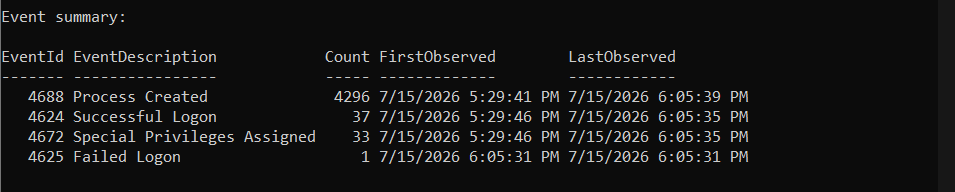
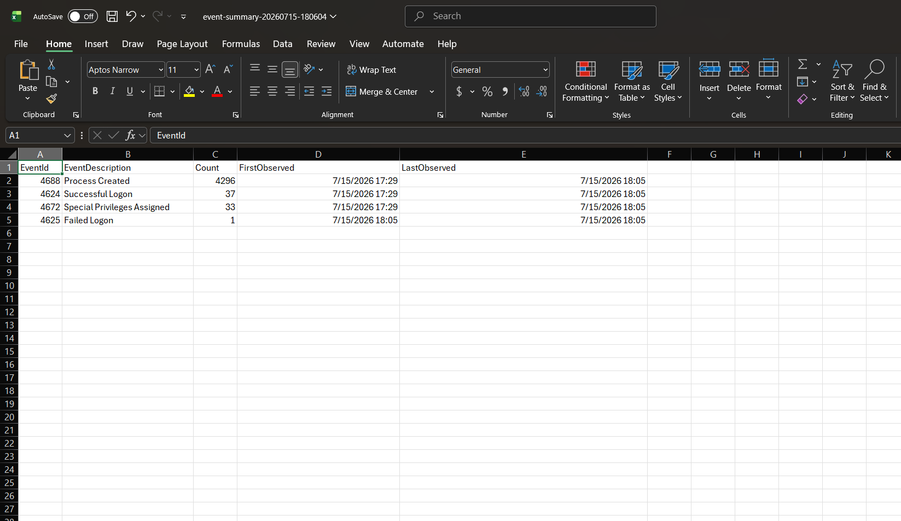

# Lab 03: PowerShell Security Automation

## Lab Status

**Completed**

## Overview

This lab demonstrates how PowerShell can automate the collection, parsing, summarization, and export of important Windows Security events.

The script reads the local Windows Security log, extracts useful SOC investigation fields, creates a detailed CSV report, and produces an event-summary report.

## Objective

The objective of this lab was to create a repeatable PowerShell workflow that reduces the manual effort required to review common Windows security events.

## Tools Used

- Windows PowerShell
- Windows Security Event Log
- PowerShell `Get-WinEvent`
- CSV reporting
- GitHub

## Event IDs Collected

| Event ID | Description |
|---|---|
| 4624 | Successful logon |
| 4625 | Failed logon |
| 4672 | Special privileges assigned |
| 4688 | New process created |

## Files

- [`Get-SocSecurityReport.ps1`](Get-SocSecurityReport.ps1) — PowerShell automation script
- `screenshots/` — execution and report evidence
- Local `output/` folder — generated CSV reports

The detailed CSV report was not uploaded publicly because it may contain local account names, endpoint details, and process paths.

## Automation Workflow

The script:

1. Checks whether PowerShell is running with administrator privileges.
2. Accepts a configurable time range using the `-Hours` parameter.
3. Reads selected events from the Windows Security log.
4. Parses Windows Event XML.
5. Extracts account, logon, source-address, failure, and process fields.
6. Exports detailed event results to CSV.
7. Groups events by Event ID and description.
8. Creates a summary CSV with counts and timestamps.
9. Displays the summary in the PowerShell console.
10. Handles common permission and data-parsing errors.

## Script Execution

The script was run using:

```powershell
.\Get-SocSecurityReport.ps1 -Hours 1
```

The script created:

```text
security-events-[timestamp].csv
event-summary-[timestamp].csv
```

## Results

The automated report identified:

| Event ID | Description | Count |
|---|---|---:|
| 4688 | Process Created | 4,296 |
| 4624 | Successful Logon | 37 |
| 4672 | Special Privileges Assigned | 33 |
| 4625 | Failed Logon | 1 |

The exact counts represent activity from the selected one-hour period.

## Findings

### Process Creation

Event ID 4688 produced the largest number of results.

This was expected because Windows, installed applications, and background services regularly create processes.

A SOC analyst would investigate unusual executable paths, suspicious parent-child relationships, encoded commands, or processes running from temporary directories.

### Successful Logons

The script identified 37 successful logon events.

Successful logons are not automatically suspicious. They should be reviewed in context with account names, logon types, source addresses, timing, and previous failed attempts.

### Privileged Logons

The script identified 33 events where sensitive privileges were assigned.

These events are common for Windows system services and administrator sessions but may require investigation when associated with unexpected accounts or unusual processes.

### Failed Login

The script successfully detected one controlled failed login.

The failed login was intentionally generated for the lab and did not represent a real attack.

Repeated failures, failures against many accounts, or a successful login immediately after repeated failures could indicate brute force or password spraying.

## Error Handling and Troubleshooting

The original script attempted to read the Windows Event XML property `#text`.

Some Windows event objects did not expose that property, which caused a `PropertyNotFoundException`.

The script was corrected to use the XML node’s `InnerText` property, which safely reads the event-data value across different Windows events.

This troubleshooting process demonstrated testing, debugging, and script improvement.

## Screenshots

### PowerShell Script Execution



### Automated CSV Summary



## Security Considerations

The detailed report may contain:

- Windows usernames
- Computer names
- IP addresses
- Process paths
- Command-line information

For this reason, only sanitized screenshots and summary information were uploaded to the public repository.

## MITRE ATT&CK Context

Repeated failed authentication attempts may be associated with:

- **Tactic:** Credential Access
- **Technique:** Brute Force
- **Technique ID:** T1110

Suspicious process creation may also support investigations involving command execution, scripting, persistence, or defense evasion.

## Analyst Conclusion

The PowerShell script successfully automated Windows Security event collection and reporting.

The automation reduced manual analysis by collecting selected Event IDs, extracting useful fields, exporting detailed results, and producing a summarized report.

This lab demonstrated how PowerShell can support SOC analysts by creating repeatable security-monitoring workflows and analyst-ready evidence.

## Skills Demonstrated

- PowerShell scripting
- Windows Security Event Log analysis
- `Get-WinEvent`
- Windows Event XML parsing
- CSV report generation
- Authentication monitoring
- Process creation analysis
- Error handling
- Script debugging
- Security data redaction
- SOC workflow automation
- GitHub technical documentation

## Resume Project Description

Developed a PowerShell security-automation script that collected and parsed Windows Event IDs 4624, 4625, 4672, and 4688, generated detailed and summarized CSV reports, handled XML parsing errors, and produced analyst-ready Windows security-event results.
