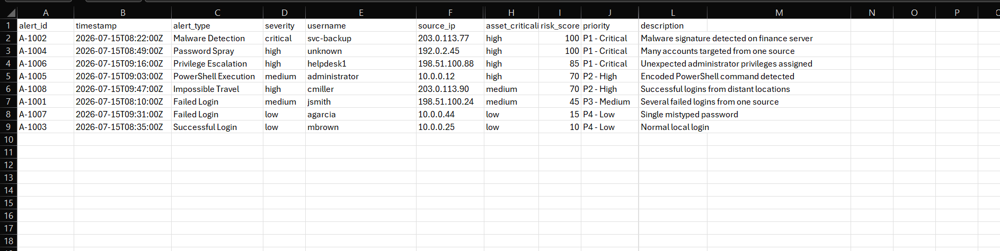
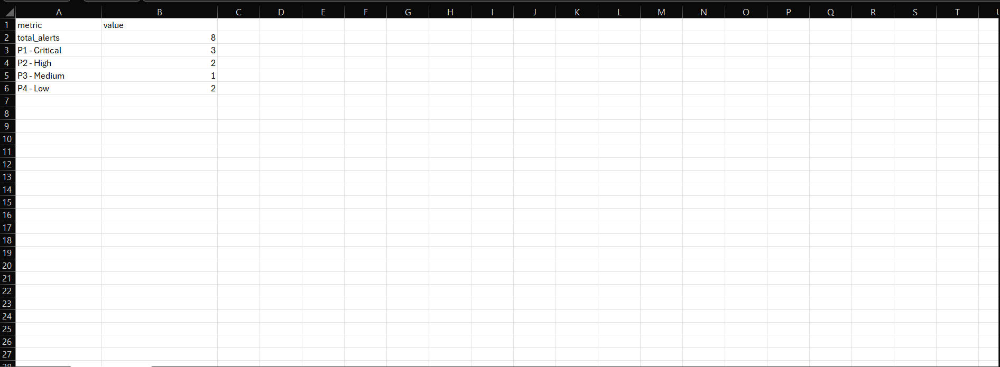

# Lab 04: Python Alert Triage Automation

## Lab Status

**Completed**

## Overview

This lab demonstrates how Python can automate the prioritization of simulated security alerts.

The program reads alerts from a CSV file, calculates a risk score, assigns a priority level, recommends an analyst response, sorts alerts by risk, and exports structured reports.

## Objective

The objective of this lab was to create a repeatable Python workflow that helps a SOC analyst identify which security alerts require immediate attention.

## Tools Used

- Python 3
- Python standard library
- CSV files
- Windows PowerShell
- Microsoft Excel
- GitHub

## Files

- [`triage_alerts.py`](triage_alerts.py) — Python alert-triage program
- [`sample_alerts.csv`](sample_alerts.csv) — simulated security-alert data
- `screenshots/` — execution and report evidence
- Local `output/` folder — generated reports

## Program Workflow

The Python program:

1. Reads alerts from a CSV file.
2. Confirms that all required columns exist.
3. Validates numerical values.
4. Reviews alert severity.
5. Reviews asset criticality.
6. Reviews the alert type.
7. Reviews failed-login counts.
8. Adds additional risk for administrator accounts.
9. Calculates a risk score from 0 to 100.
10. Assigns a P1, P2, P3, or P4 priority.
11. Generates an analyst recommendation.
12. Sorts alerts from highest to lowest risk.
13. Exports detailed and summary CSV reports.
14. Handles missing files and invalid input values.

## Priority Levels

| Priority | Risk Score | Meaning |
|---|---:|---|
| P1 - Critical | 80–100 | Immediate investigation and escalation |
| P2 - High | 60–79 | High-priority analyst review |
| P3 - Medium | 35–59 | Investigation required |
| P4 - Low | 0–34 | Document and monitor |

## Simulated Alert Types

The sample data included:

- Malware detection
- Password spraying
- Privilege escalation
- PowerShell execution
- Impossible travel
- Failed logins
- Successful login

## Script Execution

The program was run with:

```powershell
py .\triage_alerts.py .\sample_alerts.csv
```

The program generated:

```text
output\triaged-alerts.csv
output\triage-summary.csv
```

## Results

| Alert ID | Alert Type | Risk Score | Priority |
|---|---|---:|---|
| A-1002 | Malware Detection | 100 | P1 - Critical |
| A-1004 | Password Spray | 100 | P1 - Critical |
| A-1006 | Privilege Escalation | 85 | P1 - Critical |
| A-1005 | PowerShell Execution | 70 | P2 - High |
| A-1008 | Impossible Travel | 70 | P2 - High |
| A-1001 | Failed Login | 45 | P3 - Medium |
| A-1007 | Failed Login | 15 | P4 - Low |
| A-1003 | Successful Login | 10 | P4 - Low |

## Findings

### Critical Alerts

The malware-detection and password-spray alerts received scores of 100.

The malware alert involved a critical detection on a high-value asset. The recommended response was to isolate the endpoint, preserve evidence, and escalate immediately.

The password-spray alert involved 18 failed attempts against multiple accounts and a high-criticality asset. The recommended response was to block the source, review targeted accounts, and check for successful logins.

### Privilege Escalation

The privilege-escalation alert received a score of 85 and was classified as P1.

Unexpected administrator privileges can indicate account misuse or unauthorized access. The analyst should validate the privilege change and review related account and process activity.

### PowerShell Execution

The PowerShell alert received a score of 70 and was classified as P2.

PowerShell is a legitimate administrative tool but can also be used for malicious command execution. The analyst should review the command line, parent process, user context, and endpoint activity.

### Impossible Travel

The impossible-travel alert received a score of 70.

The analyst should confirm whether the activity was expected, review multifactor-authentication results, and revoke active sessions if unauthorized access is suspected.

### Failed Logins

The dataset included two failed-login alerts with different priorities.

- Three failed attempts on a medium-criticality asset received a score of 45.
- One failed attempt on a low-criticality asset received a score of 15.

This demonstrated that the program did not treat every failed login equally. It considered the number of attempts, alert severity, and asset criticality.

### Successful Login

The successful-login alert received the lowest score.

A successful login is not automatically malicious. It should only be escalated when combined with suspicious context, such as an unfamiliar location, impossible travel, repeated failures, or unusual user behavior.

## Example Analyst Recommendations

The program generated recommendations such as:

- Isolate the endpoint and preserve evidence.
- Block the password-spray source.
- Review targeted accounts for successful authentication.
- Validate unexpected privilege changes.
- Review PowerShell command-line activity.
- Confirm impossible-travel activity with the user.
- Monitor low-risk failed logins for repetition.

## Screenshots

### Python Alert-Triage Execution


### Prioritized Alert Report



### Priority Summary



## Security Considerations

The alerts in this lab were simulated and used documentation-only IP address ranges.

In a real environment, a SOC analyst would also correlate the alerts with:

- Authentication logs
- Endpoint telemetry
- Threat intelligence
- User behavior
- Asset ownership
- Network traffic
- Previous incidents
- Identity-provider logs

Risk scoring should assist analyst decision-making rather than replace human investigation.

## MITRE ATT&CK Context

| Alert Type | Possible ATT&CK Technique |
|---|---|
| Password Spray | T1110.003 — Password Spraying |
| PowerShell Execution | T1059.001 — PowerShell |
| Valid or suspicious login | T1078 — Valid Accounts |
| Privilege Escalation | Depends on the method used |
| Malware Detection | Depends on malware behavior |

## Analyst Conclusion

The Python program successfully automated the triage of simulated security alerts.

It calculated risk scores, assigned priority levels, generated analyst recommendations, sorted alerts by urgency, and created structured CSV reports.

This lab demonstrated how Python can help SOC analysts reduce repetitive work and focus attention on the alerts with the greatest potential impact.

## Skills Demonstrated

- Python programming
- CSV parsing
- Data validation
- Security alert triage
- Risk scoring
- Alert prioritization
- Conditional logic
- Error handling
- Report generation
- SOC workflow automation
- MITRE ATT&CK mapping
- GitHub technical documentation

## Resume Project Description

Developed a Python security-alert triage tool that parsed simulated alerts, calculated risk scores, assigned P1–P4 priorities, generated analyst recommendations, and exported detailed and summarized CSV reports.
