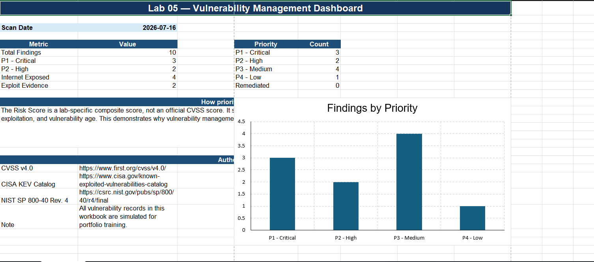
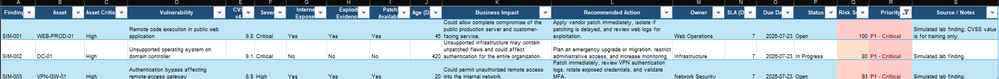
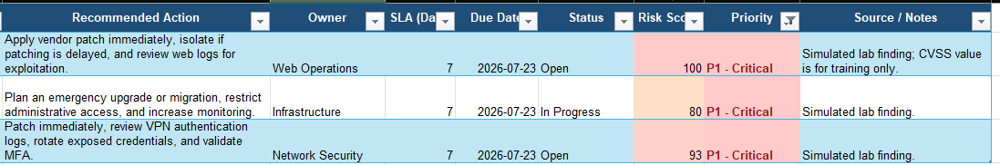

# Lab 05: Vulnerability Management Report

## Lab Status

**Completed**

## Overview

This lab demonstrates how a security analyst can review vulnerability findings, add business and threat context, prioritize remediation, assign owners and deadlines, and communicate risk to technical teams and leadership.

All findings in this project are simulated and contain no real company information, production data, or private vulnerability scan results.

## Objective

The objective of this lab was to:

1. Review simulated vulnerability findings.
2. Interpret CVSS severity.
3. Add asset criticality and exposure context.
4. Consider exploitation evidence and finding age.
5. Prioritize remediation using a transparent risk model.
6. Assign remediation owners and service-level agreements.
7. Document business impact and recommended actions.
8. Create an executive dashboard and remediation summary.
9. Demonstrate the difference between technical severity and organizational risk.

## Tools Used

- Microsoft Excel
- Simulated vulnerability data
- CVSS v4.0 concepts
- CISA Known Exploited Vulnerabilities prioritization concepts
- NIST patch-management concepts
- GitHub

## Portfolio Files

- [`Lab-05-Vulnerability-Management-Public-Workbook.xlsx`](Lab-05-Vulnerability-Management-Public-Workbook.xlsx)
- `screenshots/01-vulnerability-dashboard.png`
- `screenshots/02-priority-findings.png`
- `screenshots/03-remediation-plan.png`

## Workbook Structure

### Dashboard

The Dashboard provides a management-level overview of:

- Total findings
- P1 critical findings
- P2 high findings
- Internet-exposed findings
- Findings with exploitation evidence
- Findings grouped by priority

### Findings

The Findings sheet contains:

- Finding ID
- Asset
- Asset criticality
- Vulnerability description
- CVSS score
- Severity
- Internet exposure
- Exploitation evidence
- Patch availability
- Finding age
- Business impact
- Recommended action
- Remediation owner
- SLA
- Due date
- Status
- Lab-specific risk score
- Final priority

### Executive Summary

The Executive Summary identifies the three most urgent findings, explains the main risk drivers, assigns owners and deadlines, and documents temporary risk-acceptance requirements.

---

## Important Concepts

### Vulnerability

A vulnerability is a weakness in software, hardware, configuration, or a security process that could be exploited.

### Severity

Severity describes the technical seriousness of a vulnerability.

### Risk

Risk considers:

- Likelihood of exploitation
- Asset importance
- Internet exposure
- Threat activity
- Existing controls
- Potential business impact

### CVSS

The Common Vulnerability Scoring System provides a standardized way to communicate technical severity.

CVSS was used as one prioritization factor, but it was not treated as the complete risk decision.

### Asset Criticality

Asset criticality describes how important a system is to business operations.

The same vulnerability may require different urgency depending on whether it affects a public production server, domain controller, database, test application, or low-value device.

### Remediation SLA

A remediation service-level agreement defines the target number of days allowed to fix or formally address a finding.

---

## Risk-Based Prioritization Model

The workbook uses a lab-specific composite risk score.

The score considers:

- CVSS severity
- Asset criticality
- Internet exposure
- Exploitation evidence
- Finding age

This score is not an official CVSS calculation. It is a transparent training model designed to demonstrate how vulnerability-management teams add business and threat context to technical severity.

## Priority Levels

| Priority | Meaning | Target SLA |
|---|---|---:|
| P1 - Critical | Immediate security or business risk | 7 days |
| P2 - High | High-priority remediation | 14 days |
| P3 - Medium | Planned remediation required | 30 days |
| P4 - Low | Lower urgency; monitor and schedule | 60 days |

---

## Key Findings

### 1. SIM-001 — Public Web Server Remote Code Execution

**Asset:** `WEB-PROD-01`  
**CVSS:** 9.8  
**Priority:** P1 - Critical  
**Internet exposed:** Yes  
**Exploitation evidence:** Yes  
**Patch available:** Yes  

This was ranked as the highest-priority finding because it combined:

- Critical technical severity
- Internet exposure
- Exploitation evidence
- Remote code execution
- Direct impact to a customer-facing production service

Potential business impact included service disruption, data exposure, customer impact, lost revenue, and reputational damage.

**Recommended action:** Apply the vendor patch immediately. If patching is delayed, isolate the server and review web and endpoint logs for evidence of exploitation.

**Owner:** Web Operations  
**SLA:** 7 days

---

### 2. SIM-003 — VPN Authentication Bypass

**Asset:** `VPN-GW-01`  
**CVSS:** 8.8  
**Priority:** P1 - Critical  
**Internet exposed:** Yes  
**Exploitation evidence:** Yes  
**Patch available:** Yes  

This finding was prioritized ahead of the unsupported domain controller because the VPN gateway was directly reachable from the internet and could provide unauthorized remote access into the internal network.

**Recommended action:** Patch immediately, review VPN authentication logs, rotate potentially exposed credentials, and validate multifactor-authentication settings.

**Owner:** Network Security  
**SLA:** 7 days

---

### 3. SIM-002 — Unsupported Domain Controller

**Asset:** `DC-01`  
**CVSS:** 9.1  
**Priority:** P1 - Critical  
**Internet exposed:** No  
**Exploitation evidence:** No  
**Patch available:** No  

The domain controller was considered critical because it supports authentication across the organization.

However, it was ranked after the internet-facing web and VPN findings because it was not directly internet exposed and the scenario contained no evidence of exploitation.

Because no simple patch was available, the response required both mitigation and long-term remediation.

**Recommended action:** Restrict administrative access, segment the system, increase monitoring, and begin an emergency upgrade or migration.

**Owner:** Infrastructure  
**SLA:** 7 days for immediate risk reduction and migration planning

---

## Severity Versus Risk

The lab demonstrated that the highest CVSS score does not automatically determine the entire remediation order.

A lower-CVSS vulnerability may require faster action when it:

- Is exposed to the internet
- Has evidence of exploitation
- Affects a critical business service
- Provides access to the internal network
- Has no effective compensating controls

A strong vulnerability-management decision combines technical severity with business and threat context.

---

## Remediation Versus Mitigation

### Remediation

Remediation removes the vulnerability.

Example:

- Applying the vendor patch to the public web server

### Mitigation

Mitigation reduces risk when the vulnerability cannot be immediately removed.

Examples:

- Network segmentation
- Restricting administrative access
- Increasing monitoring
- Disabling unnecessary services
- Applying firewall restrictions
- Accelerating an upgrade or migration

The unsupported domain controller required mitigation while permanent remediation was planned.

---

## Accepted Risk

The workbook includes one simulated accepted-risk finding involving legacy TLS protocols.

Accepted risk does not mean that the vulnerability is ignored.

A proper risk-acceptance decision should include:

- Documented business justification
- Approval from an authorized risk owner
- A review or expiration date
- Compensating controls
- A permanent remediation plan
- Continued monitoring

---

## Screenshots

### Vulnerability Dashboard

### Priority Findings

### Remediation Plan

---

## Analyst Conclusion

The assessment identified three P1 findings requiring immediate attention.

The public production web-server remote code execution vulnerability was ranked first because it combined critical severity, internet exposure, exploitation evidence, and direct impact to a customer-facing service.

The VPN authentication-bypass finding was ranked second because it could provide unauthorized access into the internal network.

The unsupported domain controller remained critical but required compensating controls and an urgent migration because no simple patch was available.

This lab demonstrated how vulnerability management extends beyond identifying weaknesses. Effective vulnerability management requires analysts to evaluate technical severity, asset criticality, exposure, threat evidence, business impact, ownership, remediation deadlines, and validation requirements.

## Skills Demonstrated

- Vulnerability management
- CVSS interpretation
- Risk-based prioritization
- Asset criticality analysis
- Internet-exposure analysis
- Exploitation-context analysis
- Business-impact documentation
- Remediation planning
- SLA assignment
- Risk acceptance
- Executive reporting
- Security documentation
- GitHub portfolio development

## Resume Project Description

Created a vulnerability-management report using simulated scan data, CVSS severity, asset criticality, internet exposure, exploitation evidence, and finding age. Prioritized remediation, assigned owners and SLAs, documented business impact, and developed an executive dashboard and remediation plan.

## Disclaimer

All vulnerability records, asset names, scores, and findings in this project are simulated for educational and portfolio purposes.
